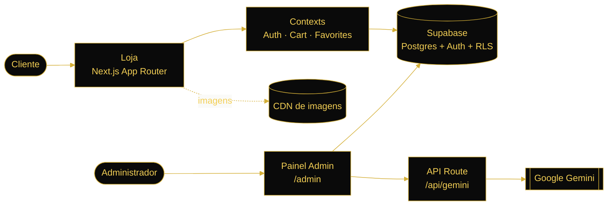
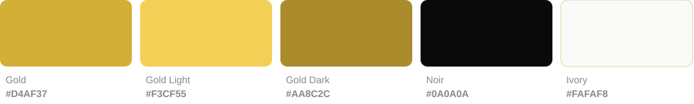
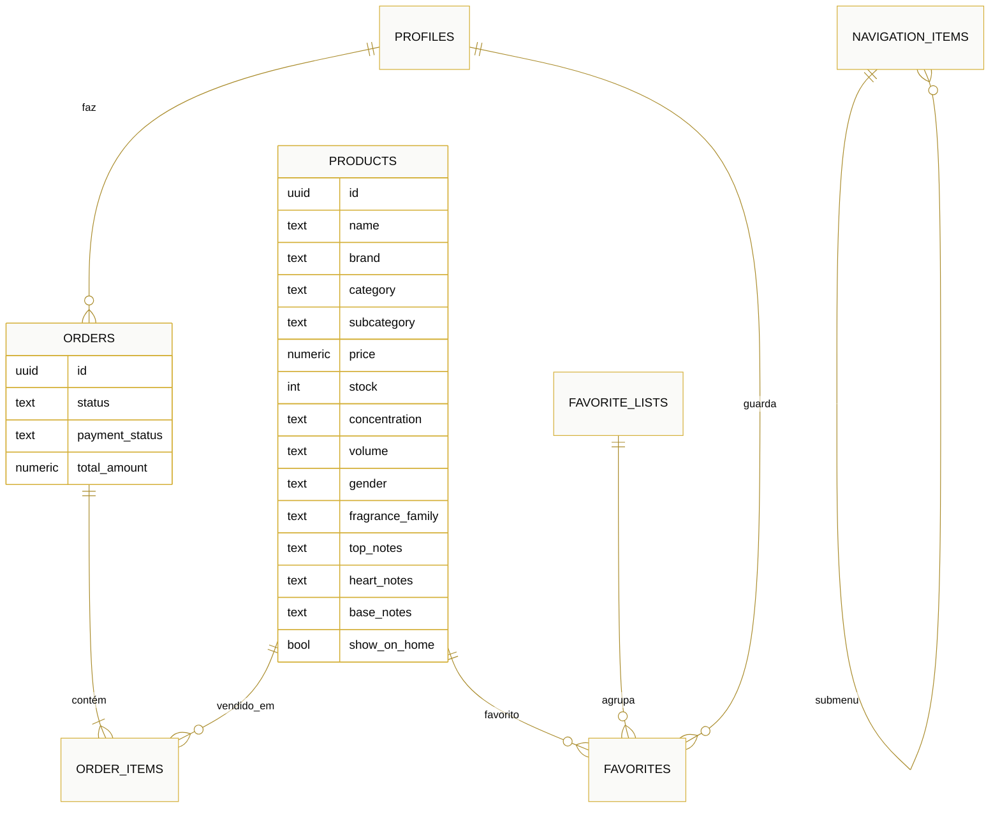

<p align="center">
  
</p>

<p align="center">
  
  
  
  
  
  
</p>

<p align="center">
  <a href="#-sobre-o-projeto">Sobre</a> ·
  <a href="#-coleção-em-destaque">Coleção</a> ·
  <a href="#-funcionalidades">Funcionalidades</a> ·
  <a href="#-arquitetura">Arquitetura</a> ·
  <a href="#-identidade-visual">Identidade Visual</a> ·
  <a href="#-instalação">Instalação</a> ·
  <a href="#-base-de-dados">Base de Dados</a> ·
  <a href="#-deploy">Deploy</a> ·
  <a href="#-estrutura-do-projeto">Estrutura</a>
</p>

---

## ✦ Sobre o Projeto

**SF Cosmetics — Cosmetics and Beauty Studio** é uma loja online de perfumaria, cosmética e acessórios de beleza, pensada para transmitir uma experiência de **luxo discreto**: fundo claro, tipografia limpa e acentos dourados.

A plataforma junta duas partes:

- **Loja** — catálogo por categorias, página de produto com pirâmide olfativa, carrinho, favoritos e conta de cliente.
- **Painel de administração** — métricas de negócio, gestão de produtos, encomendas, clientes, despesas e conteúdos. A integração com **Google Gemini** cria fichas de produto completas a partir de uma simples descrição ou de um catálogo em PDF/CSV.

O catálogo inclui uma **coleção de perfumes árabes** com 15 fragrâncias masculinas e 15 femininas das casas mais procuradas: Lattafa, Armaf, Afnan, Rasasi, Al Haramain, Maison Alhambra e Ajmal.

---

## ✦ Coleção em Destaque

<table>
  <tr>
    <td align="center" width="25%"><br /><sub><b>LATTAFA</b></sub><br />Asad<br /><sub>Eau de Parfum · 100ml</sub></td>
    <td align="center" width="25%"><br /><sub><b>ARMAF</b></sub><br />Club de Nuit Intense Man<br /><sub>Eau de Toilette · 105ml</sub></td>
    <td align="center" width="25%"><br /><sub><b>AFNAN</b></sub><br />9pm<br /><sub>Eau de Parfum · 100ml</sub></td>
    <td align="center" width="25%"><br /><sub><b>RASASI</b></sub><br />Hawas for Him<br /><sub>Eau de Parfum · 100ml</sub></td>
  </tr>
  <tr>
    <td align="center"><br /><sub><b>LATTAFA</b></sub><br />Yara<br /><sub>Eau de Parfum · 100ml</sub></td>
    <td align="center"><br /><sub><b>ARMAF</b></sub><br />Club de Nuit Woman<br /><sub>Eau de Parfum · 105ml</sub></td>
    <td align="center"><br /><sub><b>LATTAFA</b></sub><br />Fakhar Rose<br /><sub>Eau de Parfum · 100ml</sub></td>
    <td align="center"><br /><sub><b>MAISON ALHAMBRA</b></sub><br />Delilah<br /><sub>Eau de Parfum · 100ml</sub></td>
  </tr>
</table>

<details>
<summary><b>Ver a coleção completa (30 perfumes)</b></summary>

<br />

| Masculinos | Marca | Família olfativa | Preço |
|---|---|---|---:|
| Asad | Lattafa | Âmbar Especiado | 35,00 € |
| Asad Zanzibar | Lattafa | Aromático Aquático | 39,00 € |
| Fakhar Black | Lattafa | Aromático Fougère | 32,00 € |
| Odyssey Homme | Armaf | Âmbar Floral | 35,00 € |
| Club de Nuit Intense Man | Armaf | Chipre Frutado | 49,00 € |
| Club de Nuit Blue Iconic | Armaf | Amadeirado Aromático | 45,00 € |
| 9pm | Afnan | Âmbar Baunilhado | 42,00 € |
| Supremacy Not Only Intense | Afnan | Chipre Frutado | 55,00 € |
| Turathi Blue | Afnan | Amadeirado Especiado | 45,00 € |
| Hawas for Him | Rasasi | Aromático Aquático | 59,00 € |
| Hawas Ice | Rasasi | Aromático Aquático | 62,00 € |
| L'Aventure | Al Haramain | Chipre Frutado | 38,00 € |
| Salvo | Maison Alhambra | Aromático Especiado | 29,00 € |
| Jean Lowe Immortal | Maison Alhambra | Amadeirado Aromático | 29,00 € |
| Evoke for Him | Ajmal | Amadeirado Aromático | 52,00 € |

| Femininos | Marca | Família olfativa | Preço |
|---|---|---|---:|
| Yara | Lattafa | Âmbar Baunilhado | 32,00 € |
| Yara Moi | Lattafa | Âmbar Floral | 34,00 € |
| Yara Candy | Lattafa | Floral Frutado Gourmand | 36,00 € |
| Yara Tous | Lattafa | Floral Frutado | 34,00 € |
| Haya | Lattafa | Floral Frutado | 35,00 € |
| Mayar | Lattafa | Floral Frutado | 36,00 € |
| Sakeena | Lattafa | Âmbar Floral | 38,00 € |
| Fakhar Rose | Lattafa | Floral Branco | 32,00 € |
| Qimmah for Women | Lattafa | Âmbar Baunilhado | 39,00 € |
| Club de Nuit Woman | Armaf | Chipre Floral | 42,00 € |
| 9pm pour Femme | Afnan | Floral Frutado | 42,00 € |
| Hawas for Her | Rasasi | Floral Frutado | 59,00 € |
| Delilah | Maison Alhambra | Floral Frutado | 29,00 € |
| L'Aventure Femme | Al Haramain | Chipre Frutado | 38,00 € |
| Evoke for Her | Ajmal | Chipre Floral | 52,00 € |

Cada produto tem marca, concentração, volume, família olfativa, notas de topo, coração e base, país de origem e descrição longa. O seed está em [`supabase/seed_perfumes_arabes.sql`](supabase/seed_perfumes_arabes.sql).

</details>

---

## ✦ Funcionalidades

<table>
<tr>
<td valign="top" width="50%">

### 🛍️ Loja

- **Catálogo por categorias** — perfumes, rosto, corpo, cabelo, maquilhagem, bijuteria e aparelhos
- **Filtros** por subcategoria (Feminino, Masculino, Unisex…), intervalo de preço, pesquisa e ordenação
- **Página de produto** com galeria, pirâmide olfativa (topo, coração, base), família, concentração, volume e stock em tempo real
- **Carrinho** persistente (localStorage para visitantes, Supabase para clientes autenticados)
- **Favoritos** organizados em listas personalizadas
- **Autenticação** por email/password e Google OAuth
- **Homepage configurável** — hero, destaques e produtos marcados com `show_on_home`
- **Navegação dinâmica** gerida pelo CMS
- **Design responsivo** para mobile e desktop

</td>
<td valign="top" width="50%">

### 📊 Painel de Administração

- **Dashboard** com receita, encomendas, clientes e inventário, com gráficos interativos (Recharts)
- **Produtos** — CRUD completo, pesquisa, filtros, stock e imagens
- **Criação com IA (Gemini)** — descreve um produto em linguagem natural e recebe a ficha completa
- **Importação de catálogos** a partir de PDF, CSV ou texto, via IA
- **Encomendas** — estados (pendente → em processamento → enviada → entregue) e estado do pagamento
- **Clientes** — diretório com perfil, total gasto e histórico
- **Despesas** por categoria (renda, fornecedores, marketing, software, logística) com recorrência
- **CMS** — itens de navegação e blocos de conteúdo da homepage
- **Interface escura** com acentos dourados

</td>
</tr>
</table>

---

## ✦ Arquitetura



- **Rendering:** Next.js 16 com App Router. As páginas da loja são componentes client que leem o Supabase diretamente com a chave pública, protegidas por Row-Level Security.
- **Sessão:** `middleware.ts` renova a sessão Supabase em cada pedido (`@supabase/ssr`).
- **IA:** a chave Gemini fica só no servidor. O painel chama `/api/gemini`, que faz o pedido ao modelo.

---

## ✦ Identidade Visual

<p align="center">
  
</p>

| Elemento | Definição |
|---|---|
| **Cor principal** | Gold `#D4AF37`, usada em botões, marcas, preços e realces |
| **Variações** | Gold Light `#F3CF55` · Gold Dark `#AA8C2C` (tokens `--color-gold-*` em `app/globals.css`) |
| **Fundos** | Branco e Ivory `#FAFAF8` na loja, Noir `#0A0A0A` no painel e nos banners |
| **Tipografia** | [Poppins](https://fonts.google.com/specimen/Poppins) via `next/font`; títulos em maiúsculas com espaçamento largo |
| **Logótipo** | `public/logo-original.png` (horizontal) · `public/logo-nobg.png` (monograma) |

<p align="center">
  
</p>

---

## ✦ Tech Stack

| Camada | Tecnologia |
|---|---|
| **Framework** | [Next.js 16](https://nextjs.org/) (App Router) |
| **Linguagem** | [TypeScript 5](https://www.typescriptlang.org/) |
| **UI** | [React 19](https://react.dev/), [Tailwind CSS 4](https://tailwindcss.com/) |
| **Componentes** | [Radix UI](https://www.radix-ui.com/), [shadcn/ui](https://ui.shadcn.com/), [Lucide Icons](https://lucide.dev/) |
| **Backend / BD** | [Supabase](https://supabase.com/) (PostgreSQL + Auth + RLS) |
| **Autenticação** | Supabase Auth (email + Google OAuth) |
| **IA** | [Google Gemini](https://ai.google.dev/) via `@google/generative-ai` |
| **Gráficos** | [Recharts](https://recharts.org/) |
| **Notificações** | [Sonner](https://sonner.emilkowal.dev/) |

---

## ✦ Instalação

### Pré-requisitos

- [Node.js](https://nodejs.org/) 18 ou superior
- [npm](https://www.npmjs.com/)
- Um projeto no [Supabase](https://supabase.com/)
- Chave da API [Google Gemini](https://ai.google.dev/) (opcional, só para as funcionalidades de IA)

### Passos

```bash
# 1. Clonar o repositório
git clone https://github.com/rodrigofariarocha/Sf_Cosmetics.git
cd Sf_Cosmetics

# 2. Instalar dependências
npm install

# 3. Configurar as variáveis de ambiente
cp .env.example .env.local

# 4. Preparar a base de dados (ver secção seguinte)

# 5. Iniciar em modo de desenvolvimento
npm run dev
```

A aplicação fica disponível em **http://localhost:3000** e o painel em **http://localhost:3000/admin**.

### Variáveis de Ambiente

```env
# Supabase
NEXT_PUBLIC_SUPABASE_URL=https://o-teu-projeto.supabase.co
NEXT_PUBLIC_SUPABASE_ANON_KEY=a-tua-anon-key

# Google Gemini (opcional)
GEMINI_API_KEY=a-tua-chave-gemini
```

> [!IMPORTANT]
> Os ficheiros `.env*` estão no `.gitignore`. Nunca faças commit de chaves; usa as variáveis de ambiente do Vercel em produção.

---

## ✦ Base de Dados

O projeto usa Supabase (PostgreSQL) com Row-Level Security. As tabelas `products`, `orders`, `order_items`, `profiles`, `favorites`, `favorite_lists` e `cart` são criadas no Supabase. Os scripts da pasta `supabase/` acrescentam o resto e devem correr no **SQL Editor** por esta ordem:

| # | Ficheiro | O que faz |
|:-:|---|---|
| 1 | `setup_cms.sql` | Cria `navigation_items`, `content_blocks` e `expenses` |
| 2 | `update_products_schema.sql` | Adiciona `show_on_home` aos produtos |
| 3 | `migrations/add_subcategory_column.sql` | Adiciona `subcategory` |
| 4 | `migrations/add_product_details.sql` | Adiciona os campos de perfumaria: marca, volume, género, família, notas, concentração, origem, avaliação |
| 5 | `fix_rls_policies.sql` | Políticas de Row-Level Security |
| 6 | `seed_navigation.sql` | Menu de navegação por defeito |
| 7 | `seed_products.sql` | Produtos de exemplo de várias categorias |
| 8 | `seed_perfumes_arabes.sql` | Coleção de 30 perfumes árabes (15 masculinos e 15 femininos) |

### Modelo de dados



### Importar produtos por CSV

```bash
node scripts/import-products.mjs data/template-produtos.csv
```

O modelo [`data/template-produtos.csv`](data/template-produtos.csv) tem as colunas `name, description, price, category, subcategory, stock, image_url, show_on_home`.

---

## ✦ Deploy

O projeto está pronto para o [Vercel](https://vercel.com/):

1. Importar o repositório no Vercel
2. Definir `NEXT_PUBLIC_SUPABASE_URL`, `NEXT_PUBLIC_SUPABASE_ANON_KEY` e `GEMINI_API_KEY` em **Settings → Environment Variables**
3. No Supabase, em **Authentication → URL Configuration**, adicionar o domínio de produção e o callback `https://<domínio>/auth/callback`
4. Fazer deploy

---

## ✦ Estrutura do Projeto

```
├── app/                      # Next.js App Router
│   ├── page.tsx              # Homepage
│   ├── layout.tsx            # Layout raiz (providers, fonte Poppins)
│   ├── account/              # Conta do cliente
│   ├── admin/                # Painel de administração
│   ├── api/gemini/           # API Route — integração com o Gemini
│   ├── auth/                 # Callback OAuth e página de erro
│   ├── cart/                 # Carrinho
│   ├── favorites/            # Favoritos
│   ├── products/[id]/        # Página de produto
│   ├── register/             # Registo
│   └── shop/[category]/      # Loja por categoria
├── components/
│   ├── client/               # Header, footer, showcase, página de produto
│   ├── admin/                # Dashboard de administração
│   ├── ui/                   # Componentes shadcn/ui
│   └── product-card.tsx      # Cartão de produto
├── contexts/                 # Auth, Cart, Favorites
├── lib/supabase/             # Clientes Supabase (browser, server, middleware)
├── types/                    # Tipos TypeScript (Product, Order, …)
├── supabase/                 # Scripts SQL, migrações e seeds
├── scripts/                  # Importação CSV e manutenção
├── data/                     # Modelos CSV
├── docs/readme/              # Banner e paleta deste README
└── public/                   # Logótipos e assets estáticos
```

### Scripts

| Comando | Descrição |
|---|---|
| `npm run dev` | Servidor de desenvolvimento |
| `npm run build` | Build de produção |
| `npm run start` | Servidor de produção |
| `npm run lint` | Linting com ESLint |

---

## ✦ Créditos e Licença

- Imagens e notas olfativas dos perfumes: [Fragrantica](https://www.fragrantica.com/). Servem apenas de demonstração do protótipo; antes de entrar em produção devem ser substituídas por imagens próprias ou autorizadas pelas marcas.
- Os nomes e marcas dos perfumes pertencem aos respetivos proprietários.
- Projeto privado e de uso exclusivo.

<br />

<p align="center">
  <br />
  <sub>Desenvolvido por <b>Rodrigo Rocha</b> · SF Cosmetics and Beauty Studio</sub>
</p>
